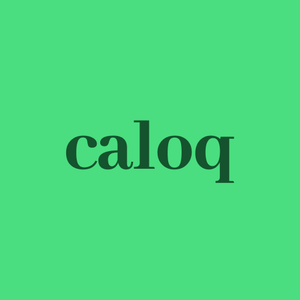

# caloq, the calorie tracking app

  

<a href="https://play.google.com/store/apps/details?id=li.l5d.caloq">Downloadable on the Google Play Store</a>

## Disclaimer

This project is currently only targeting Android since I originally had no plan of publishing it and only built it for myself.

## Development

This project uses [Expo](https://expo.dev/).

1. Clone the repo
2. `npm install`
3. `npm start`
4. Scan the QR code with the Expo Go app
